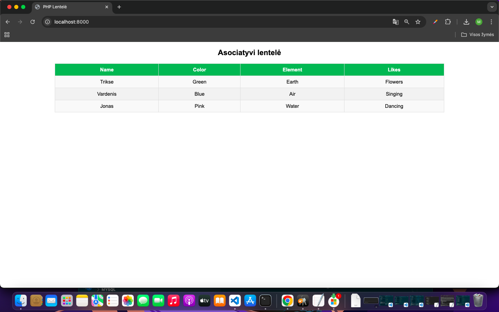
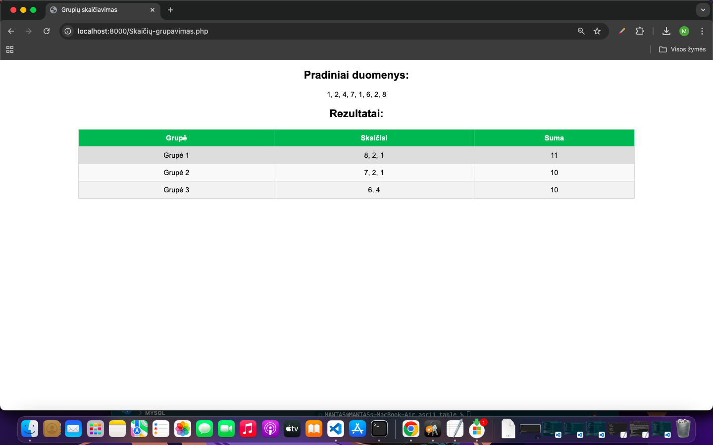

# lenteles

## ASCII LENTELE

### Skaičių grupavimas

#### Instaliacija

1. Nusiklonuokite šį repozitoriją į savo kompiuterį.
2. Atsidarykite terminalą ir pakeiskite direktoriją į clone repozitoriją.

3. paleidziant terminale php -S localhost:8000